[GitHub: Ch4mbi](https://github.com/Ch4mbi)

# Disk analysis & Autopsy

[https://tryhackme.com/room/autopsy2ze0](https://tryhackme.com/room/autopsy2ze0)

Para este ctf hay que cargar en autopsy el entorno de la tarea. Una vez cargado, que llevará un rato, se puede empezar a analizar.  
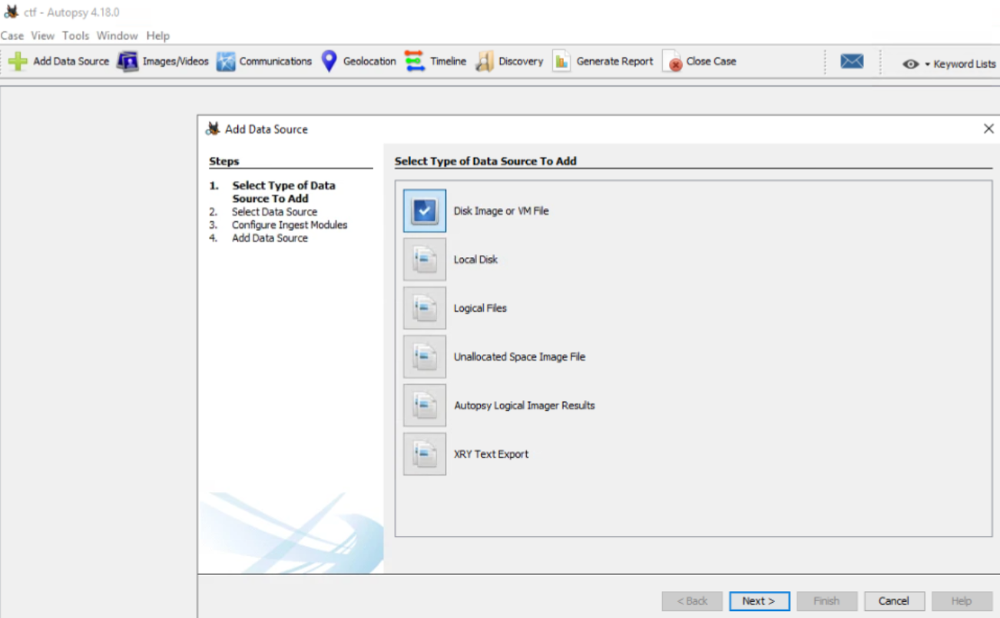 
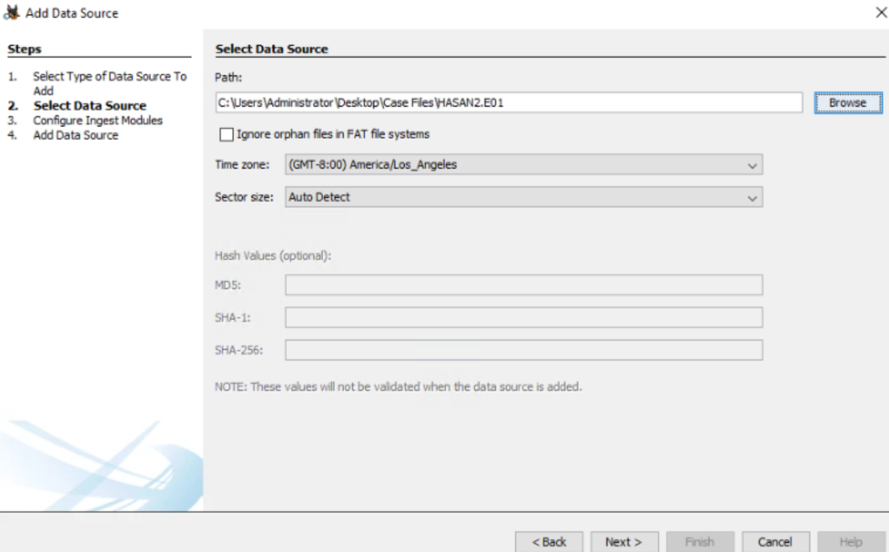   
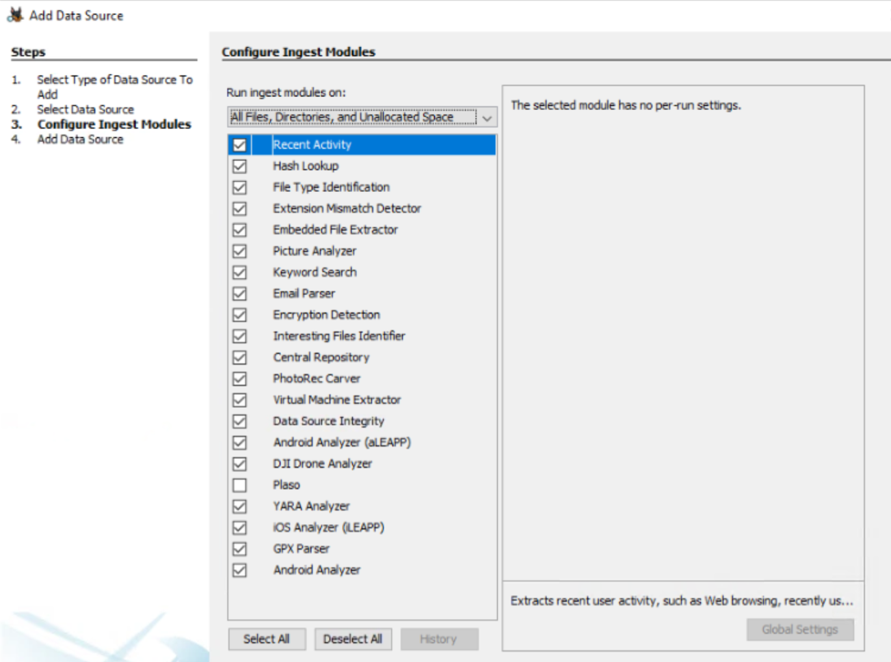 

## 1 

La primera pregunta dice que cual es el MD5 del archivo. Me voy a meter en Data Sources y seleccionar HASAN2.E01. Una vez ahí , he seleccionado la opción de summary y he ido a container, donde está el MD5 del archivo E01: 3f08c518adb3b5c1359849657a9b2079  

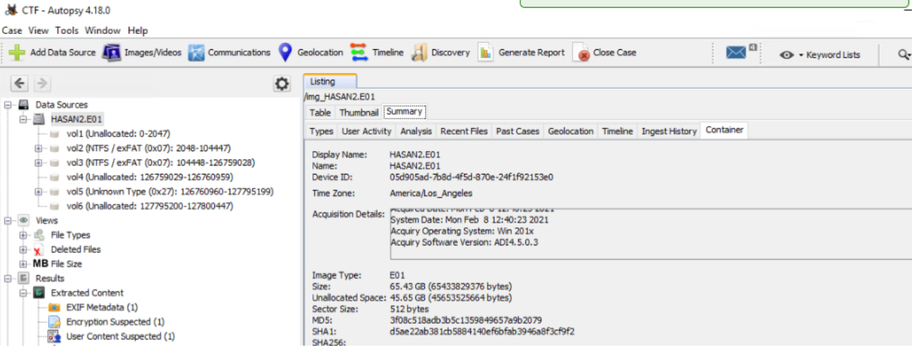 

## 2  

La segunda pregunta pide el nombre de la cuenta del ordenador, por lo que voy a mirar en la informacion del sistema(Operating System Information), ahí se ve que el nombre es: DESKTOP-0R59DJ3  

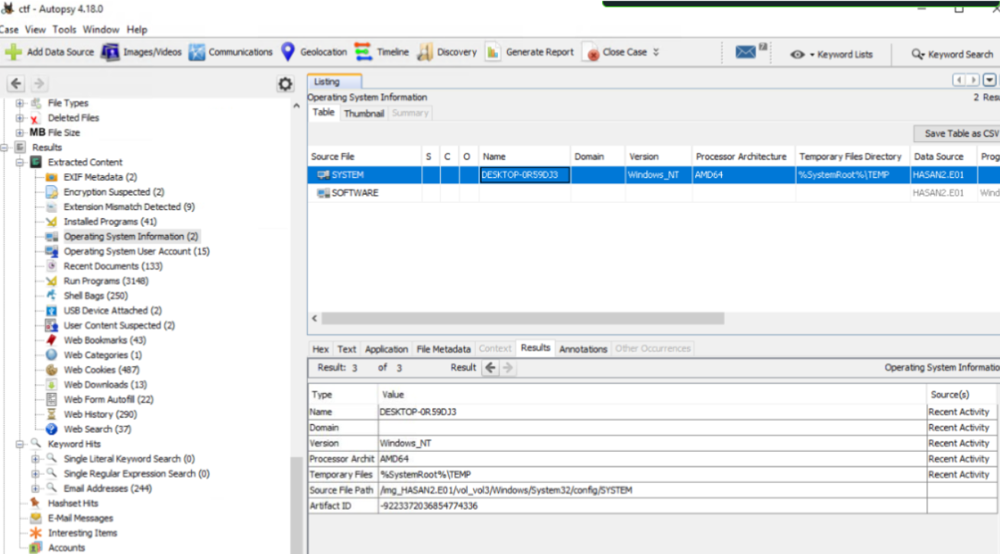  

## 3 

La siguiente pregunta pide el listado de las cuentas del ordenador. Siguiendo esta ruta en autopsy:Results →Extracted content →Operating Sysem user account, se ve que hay unos cuantos usuarios, por lo que se van a listar(En orden alfabético) la lista normal va en este orden: keshav,sivapriya,sandhya,srini, H5S4N, joshwa,suba,shreya  

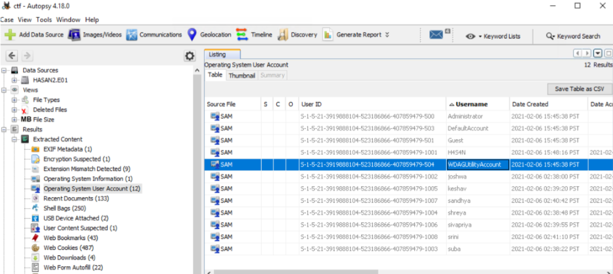 

Desde ahí,también se puede responder a la siguiente pregunta, que es cual es el último usuario que ha iniciado sesión en la máquina, se ve en la columna de date accessed, se ordena por más reciente y se ve que fue sivapriya 

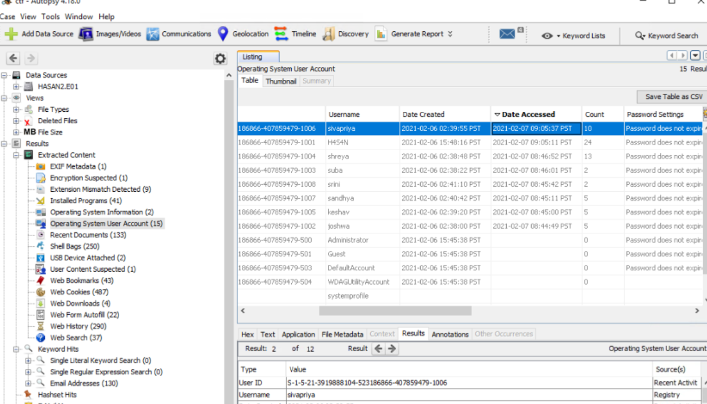   

## 4   

La siguiente pregunta pide la ip del ordenador. No encuentro la carpeta de SYSTEM(Seguramente porque no haya cargado, lleva mas de una hora y no avanza), asi que voy a intentar encontrar la ipen otro sitio. En otro sitio, en extarcted content, installed programs, se ve como hay uno llamado Look@LAN 2.50 Build 35, LAN significando Local Area Network, dando una posibilidad a que en las carpetas de HASAN2.E01 haya información de esa app u , por ende , de la ip. 

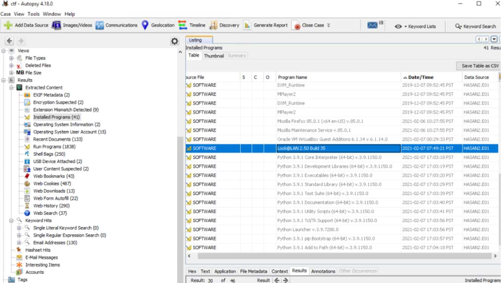   

Siguiendo esta ruta: Data sources→HASAN2.E01 →vol3→ Program Files(x86) se encuentra una carpeta llamada Look@LAN  
En el .ini e irunin.ini,  en el apartado de text se ven varias filas de información como la ubicación del archivo de Look@LAN , el usuario HASAN y la ip(abajo)  

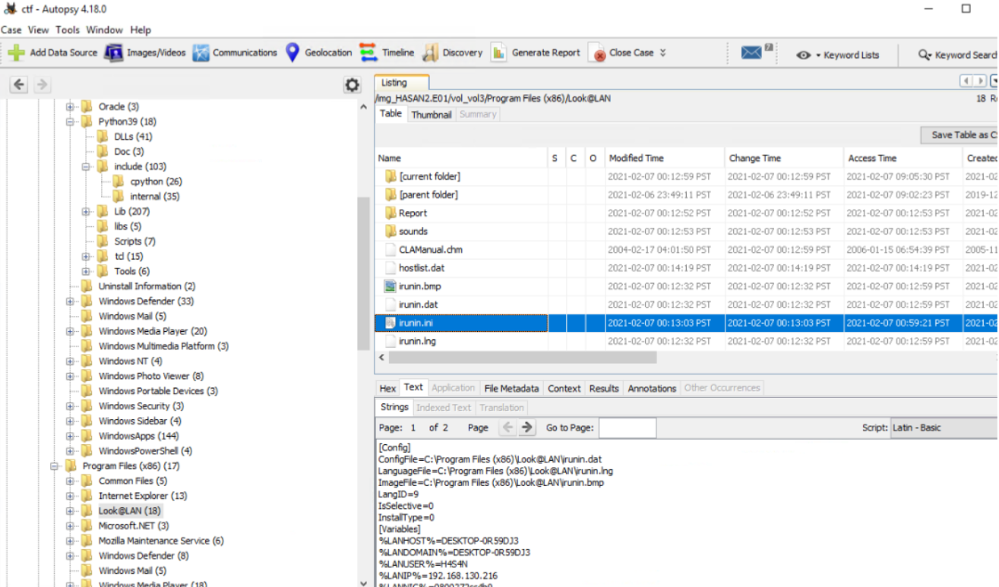  

La ip siendo: 192.168.130.216  
La siguiente pregunta pide la MAC, y es de esperar si esta aplicación hay adquirido la ip del dispositivo , es posible que tambien contenga la MAC del mismo.La NIC es la tarjeta de interfaz de la red, y si se sabe o se busca en internet, se ve que una NIC tiene una MAC única. Por lo que, estando debajo de la ip se ve una sección en la que pone: %LANNIC% dando a entender que es la NIC, siendo la MAC: 0800272cc4b9 , pero una MAC esta separada, se va a separar en el formato de mac (XX-XX-XX-XX-XX-XX) para que de la solución: 08-00-27-2c-c4-b9  

## 5  

La siguiente pregunta pide la ubicación de google maps que está archivada, las coordenadas. Voy a buscar en web bookmarks. 

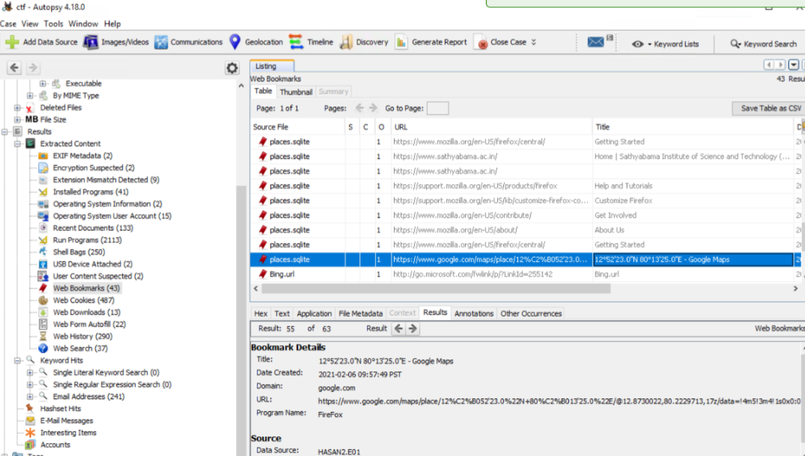  

Se ve que ha buscado y ha marcado una ubicación , coordenadas en google maps , que son: 12°52'23.0"N 80°13'25.0"E  

## 6  

La siguiente pregunta indica que el usuario tiene un fondo de pantalla con su nombre. Tras buscar durante un tiempo en los Users de esta rita: Data Source→ Hasan2.e01→Vol3→Users, el usuario Joshwa, he visto que tiene algunas imagenes en Documents→Downloadas, tars analizar esas imagenes, se ve el nombre de Anto Joshwa  

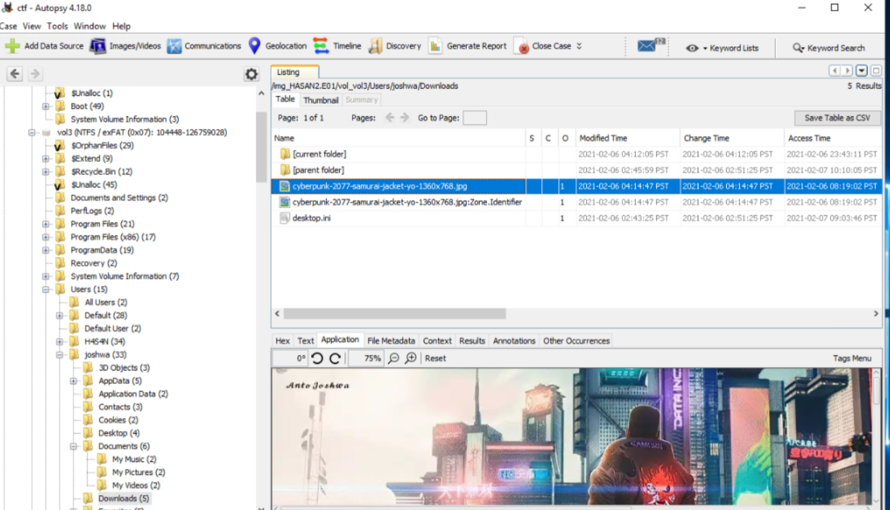   

## 7  

La siguiente pregunta indica que un usuario tenía una archivo en su Desktop, pero q lo cambió usando Powershell, y pide la flag que cambió. Voy a  revisar los Desktops de cada usuario buscando algo más, teniendo qne cuenta q todos parecen tener todos 2 carpetas y un archivo txt y un archivo ini. El usuario shreya tiene 5 documentos: las 2 carpetas, un ini, un exploit.ps1(Diferente al resto de escritorios) y un txt, 5\. Tras revisar los documentos, se ve como shreya.txt , en la opción de text , se ve la flag:  

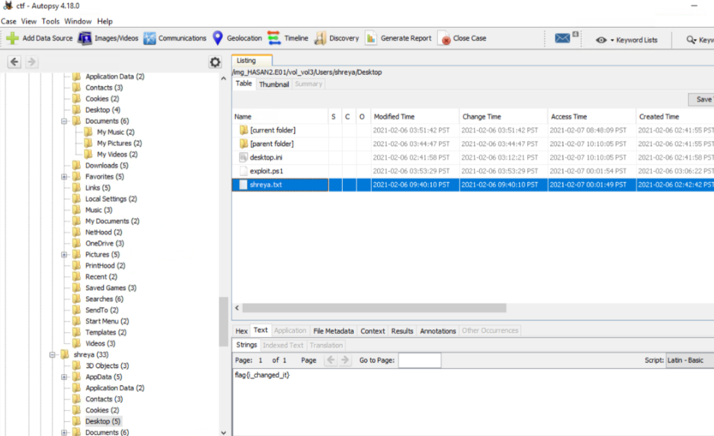 

Pero parece no ser la respuesta correcta, por los errores que da al introducirla, y también porque la respuesta no está en el escritorio y se nos dice que usando powershell se cambió.Se va a intentar buscar la información del powershell.  
Tras buscar un rato en varias carpetas, he encontrado una carpeta llamada Powershell. La ruta para llegar es: vol3→Users→shreya→AppData→Roamming→Microsoft→Windows→Powershell dentro de la carpeta de powershell hay tra carpeta llamada PSReadLine, y dentro hay un txt llamado ConsoleHost\_history(El historial de comandos). Tras abrirlo y seleccionar Text, se ve un listado de comandos y se ve como el de shreya.txt al principio era: flag{HarleyQuinnForQueen}  

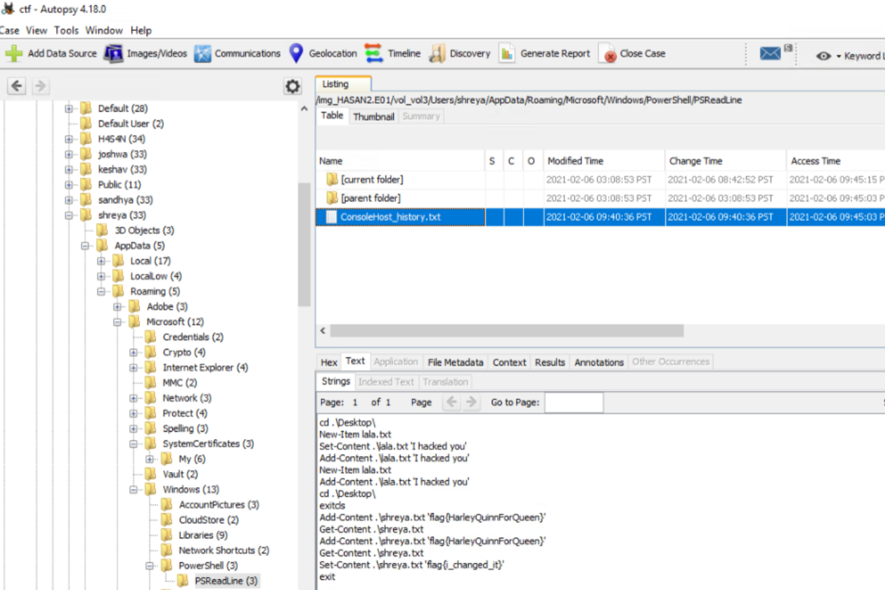   

## 8 

La siguiente pregunta dice que el mismo usuario tenía un exploit para escalar privilegios, y pide el mensaje al dispositivo. Antes se vió un .ps1 que se llamaba exploit en el pc de shreya, si se da a la opción de texto aparecen mensajes y comandos , en uno de ellos se ve que pone: Flag{I-hacked-you}  

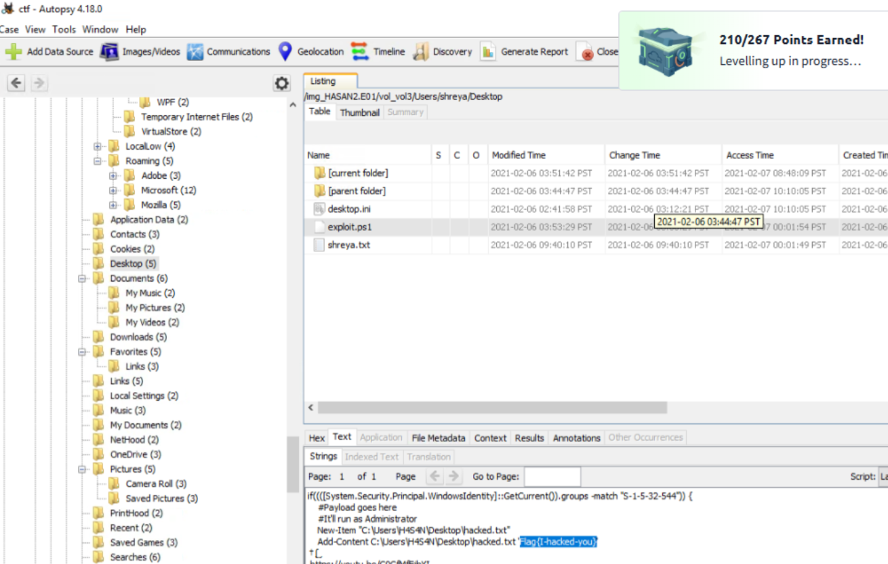  

## 9  
La siguiente pregunta dice que había 2 herramientas de hackeo enfocadas en las contraseñas en el sistema, y pide los nombres.Primero voy a mirar en los usuarios para ver si alguno ha descargado algo Tras buscar en los usuarios, el primero HASAN, siguiendo esta ruta:vol3→Users→H4s4n→Downloads, se ve como hay un zip llamado mimikatz, que es una herramienta de hackeo

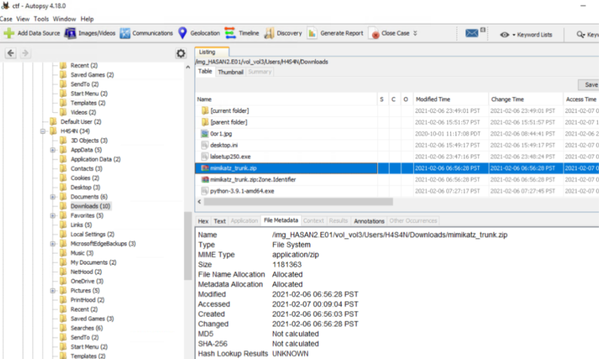   

Y el antivirus lo detectó:  

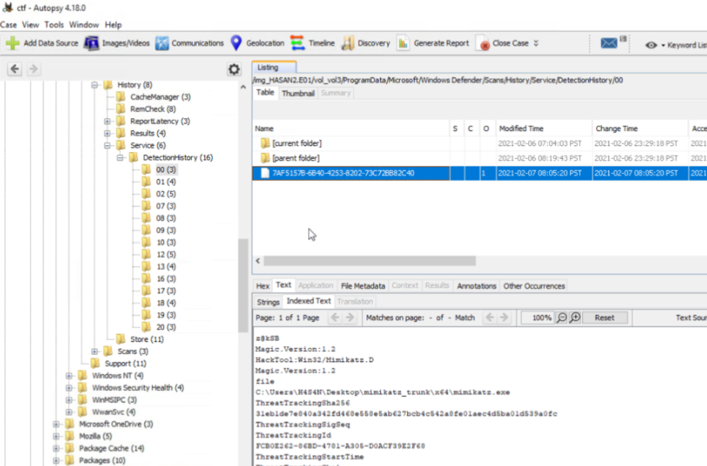  

Para llegar a esta doble confirmación, he mirado en el microsoft defender siguiendo esta ruta: Vol3→Programdata→Microsoft→WindowsDefender→Scans→History→Service→Detectionhistory, y ahí se ven varias alertas, en la de mimikatz, pone “Hacktool:” y por ejemplo hay un troyano, pero que no es hacktool, por lo que debo buscar los que estén clasificados como hacktools  
Despues de ver los textos de las alertas, me encontré con otra hacktool: LaZagne  

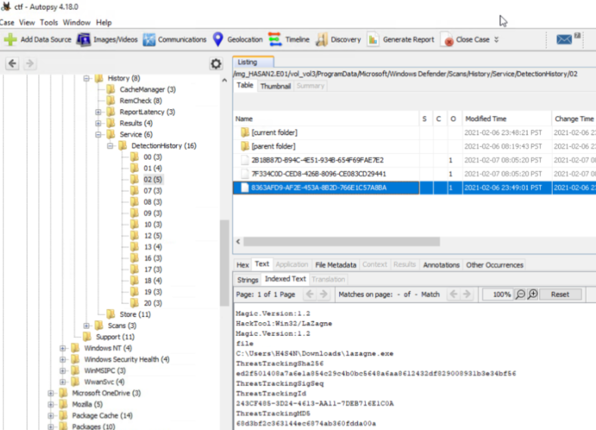 

## 10  

La siguiente pregunta indica que hay un archivo YARA en el ordenador, debo inspeccionarlo y encontrar el nombre del autor. Para buscar un archivo especifico voy a buscar por su terminación (.yar al ser un archivo YARA)  
Se va a dar a Tools y a seleccionar File Search by Attributes  

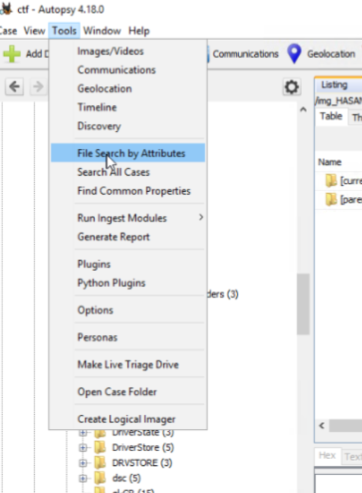   

Después se abrirá una ventana en la que hay que seleccionar la opción Name y poner .yar  

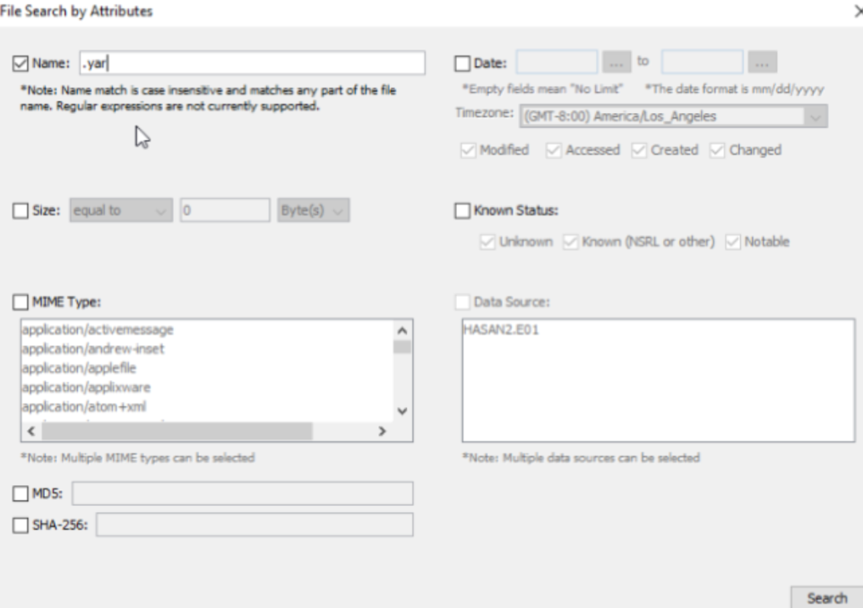  

Al pulsar search, sale esto:  

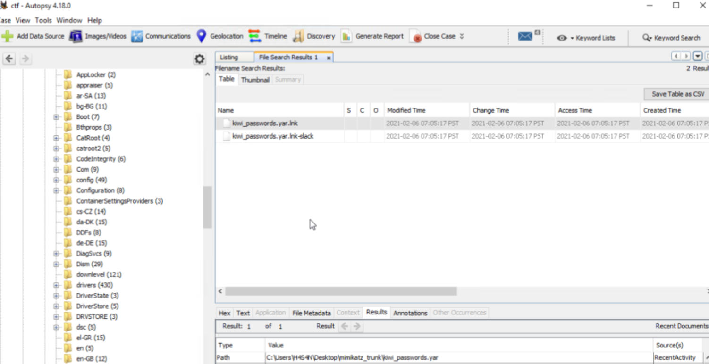  

Seleccionando el segundo , he podido detectar el nombre del autor en un apartado que pone author  

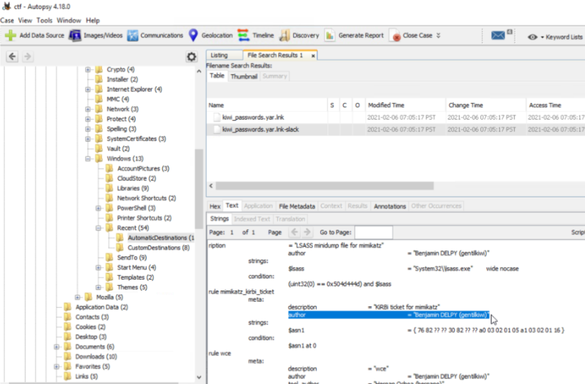  

El nombre del autor es Benjamin DELPY (gentilkiwi)

## 11  

La ultima pregunta dice que uno de los usuarios quería explotar un dominio con un exploit basado en MS-NRPC. Pide el nombre del archivo encontrado.  MS-NRPC corresponde  a las siglas Microsoft Netlogon Remote Protocol ,se usa en windows para autenticar procesos y gestionar servicios con un controlador de dominio. Si se buscan exploits del mismo en internet sale uno llamado Zerologon que parece ser el nombre del exploit del MS-NRPC  
[https://learn.microsoft.com/en-us/answers/questions/380550/vulnerability-name-microsoft-netlogon-elevation-of](https://learn.microsoft.com/en-us/answers/questions/380550/vulnerability-name-microsoft-netlogon-elevation-of)  
Voy a empezar a revisar a los usuarios.  
Tras  un rato de revisar los usuarios, he encontrado Zerologon en el usuario sandhya, siguiendo esta ruta: Data Sources→ H4S4N→vol3→Users→sandhya→AppData→Roaming→Microsoft→Windows→Recent. En esa ruta he encontrado el archivo que contiene  Zerologon 

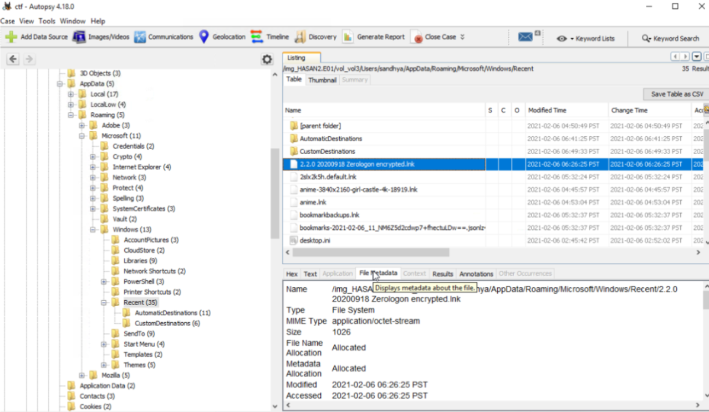   

Que es 2.2.0 202009 18 Zerologon encrypted.lnk, aunque parece estar en .zip (Me he enterado porque la respuesta como tal no valia con el .lnk)![]

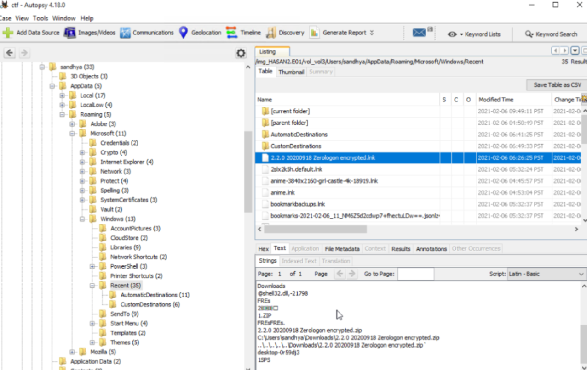  

Pone que es un .zip, por lo que sería 2.2.0 202009 18 Zerologon encrypted.zip  

