# Investigating Windows

[https://tryhackme.com/room/investigatingwindows](https://tryhackme.com/room/investigatingwindows)

## Versión y año de la máquina

Se hace windows r y se ejecuta “winver”  

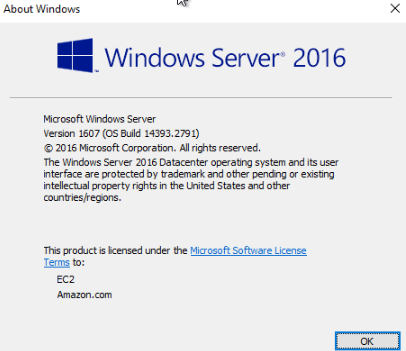

## Último login

Se puede usar el Event viewer de windows para revisar los logins  
Después hay que acceder windows logs → Security  
Para saber el id de los logs conseguidos, se busca en internet:  
[https://learn.microsoft.com/en-us/previous-versions/windows/it-pro/windows-10/security/threat-protection/auditing/basic-audit-logon-events](https://learn.microsoft.com/en-us/previous-versions/windows/it-pro/windows-10/security/threat-protection/auditing/basic-audit-logon-events)  
Se ve como el veneto 4624 es el de que un usuario se ha logueado en el pc  
Y si se le da a la derecha, a filter, se pueden filtrar los resultados 

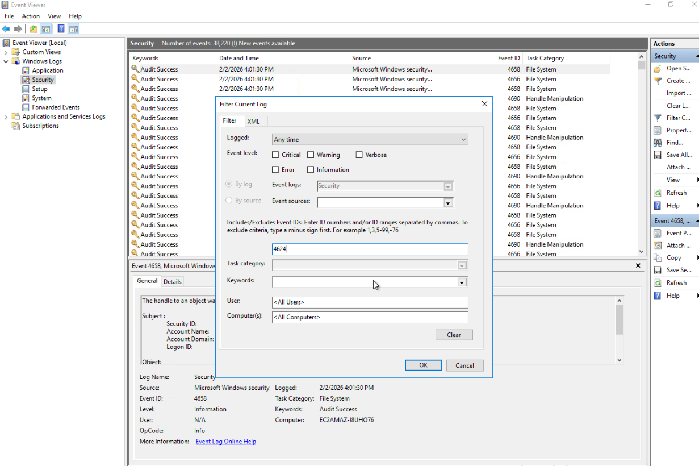  

Se ve que la 5 opción de las que sale, el account name es admin:  

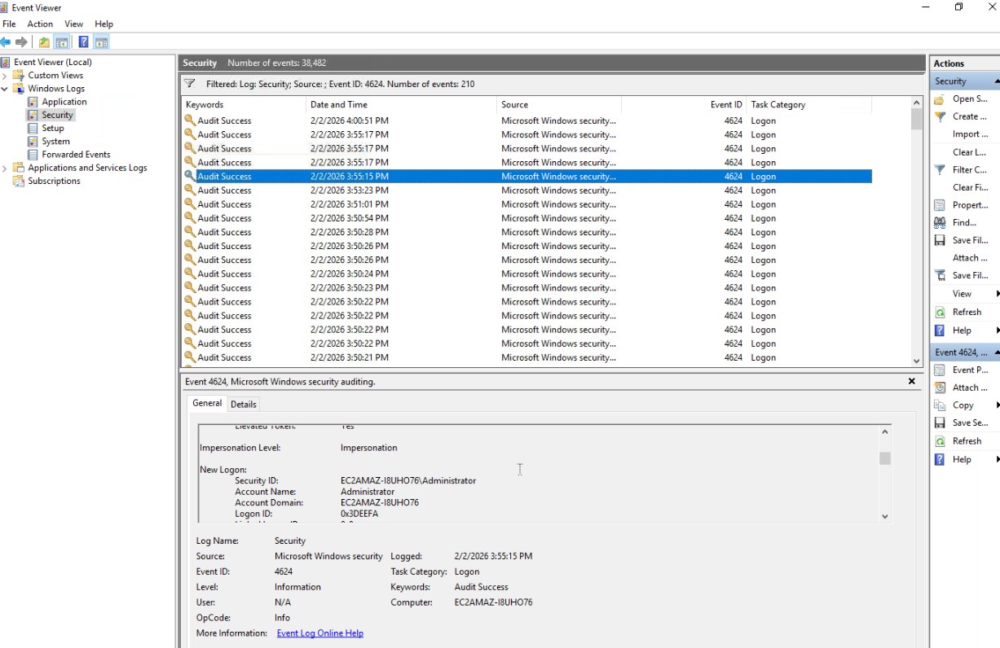

## Último log de john **

Se puede usar el cmd para buscar el usuario John y su última conexión  
Se puede usar net user. El comando net sirve para gestionar usuarios, grupos, servicios,...  
[https://learn.microsoft.com/es-es/windows-server/administration/windows-commands/net-user](https://learn.microsoft.com/es-es/windows-server/administration/windows-commands/net-user)  

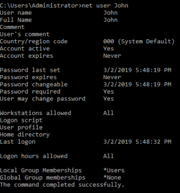 

Resultando que el usuario John, la ultima vez que hizo login fue el 03/02/2019 5:48:32 PM

## Ip a la que se conecta el pc 

Este aspecto se ve al principio, cuando se enciende el entorno en las ventanas cmd que se abren , indicando que el pc es de una víctima  

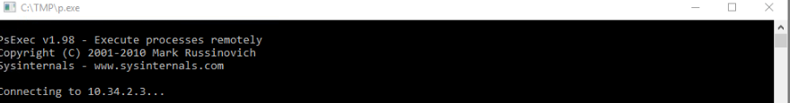

## 2 cuentas con permisos de admin  

Para ver los roles de admin que tienen 2 usuarios en específico se puede volver a usar net user, primero sin usuarios para verlos todos 

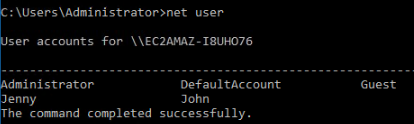 

Se ve que son:  
- Administrator  
- DefaultAccount  
- Guest  
- Jenny  
- John

Ahora se ejecuta net user y cada usuario, menos admin, para ver cuales tienen privilegios de administrador  

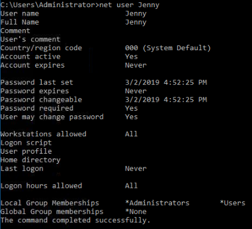  

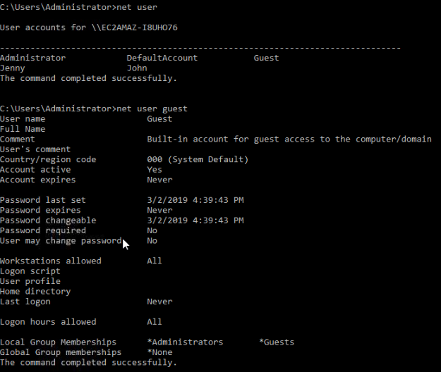 

Como se ve, los usuarios que tienen dichos privilegios son Jenny y Guest

## Archivo que el proceso intenta ejecutar diariamente  
En this pc, local disk, tmp se pueden ver varios archivos. TMP parece ser una carpeta de windows en la que se almacenan archivos temporales de aplicaciones, por lo que es posible que ahí haya algo sobre el virus, digo parece porque normalmente es Temp, no TMP. TMP puede ser normal  sería una abreviatura de Temp,o una carpeta creada por algún programa en especifico , tambien hay que tener en cuenta que los archivos generados en temp suelen ser .log por ejemplo

Hay tres archivos que son de tipo powershell:  
- nc  
- schtasks-backdoor  
- WMIBackdoor

Es algo poco común en la carpeta temp

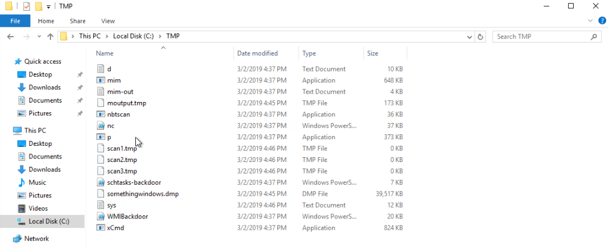  

A demás, normalmente sigue una ruta legítima, como C:/Windows/TMP o similares, pero esta está directamente en C:/TMP 

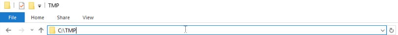  

Por lo que es muy probable que sea “falsa” o “artificial”

Luego, sabiendo que en el task scheduler se pueden ver de primera mano tareas automáticas de manera centralizada del dispositivo, lo que puede ser la “persistencia” del virus en el sistema  
Tras investigar las acciones de cada uno, se ve como el clean File System tiene como acción empezar un programa, nc, por lo que voy a probar con ese y el tipo de archivo, windows powershell, (.ps1) 

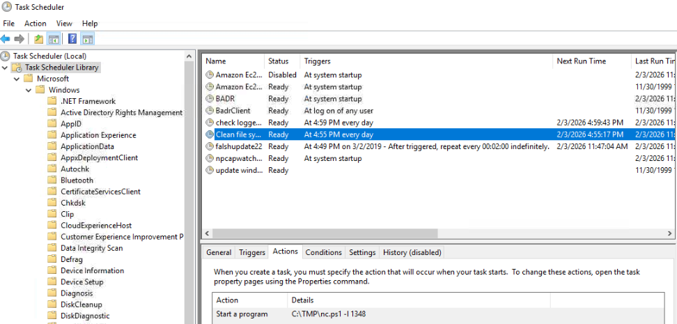  

## Nombre de la tarea maliciosa 

En el task scheduler se puede ver que , otra vez, la tarea maliciosa es clean file system que es la que ejecuta el malware 

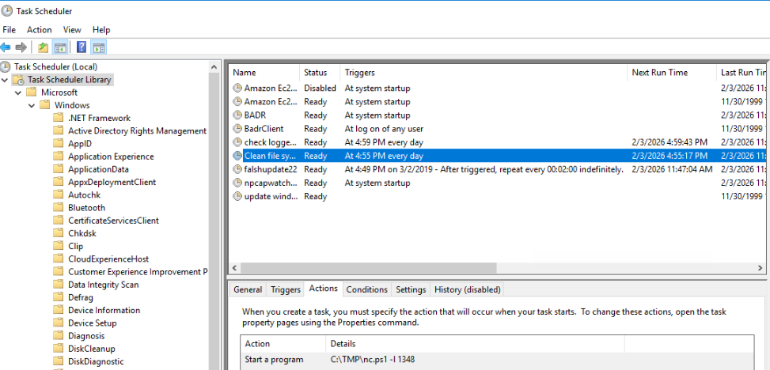  

A demas, en la informacion del sistema, system information, se ve como , como se mencionó antes, ningun archivo temp tiene la ruta similar como c:/TMP  

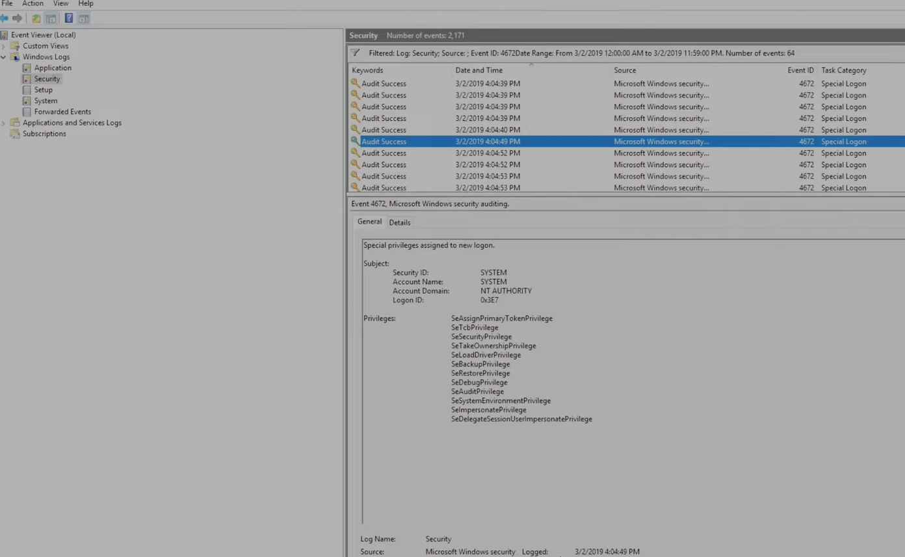 

Por lo que hace que el proceso con dicho programa en c:/tmp sea raro, y confirmando que es artificial

## Puerto en el que el archivo escucha localmente  

Desde el task scheduler, otra vez donde estaba el clean file system, al lado de la ruta sospechosa de C:/TMP/nc, se ve el puerto al que está escuchando(-l que es listenning), el cual es 1348 

## Ultimo logon de jenny  

Como se ve en el net user Jenny, nunca  

## Fecha en la que se dieron permisos especiales a un nuevo logon

Para eso se busca que ID de proceso(PID) es para buscarlo en el visor de eventos. El “evento de asignación de privilegios especiales” es 4672, por lo que se va a filtrar en el event viewer para buscarlo  
Tambien se debe filtrar para para que abarque la fecha del ataque inicial, 03/02/2019, las 24 horas del dia para ver los eventos 

   

03/02/2019 4:04:49 PM

## Herramienta contraseñas windows

En la carpeta extraña de TMP hay varias aplicaciones:  
- mim  
- nbtscan  
- p  
- xCmd

También se ve un documento de texto que se llama mim out, el cual, al abrirlo,parece que mim era una abreviatura de mimikatz, software el cual sirve para robar contraseñas, el cual parece ser el software   
Aun asi, se puede ver con el powershell para asegurarme, ya que si sospecho que el mim es en realidad mimikatz, debo de sacar el hash del mismo para ponerlo en virustotal y confirmarlo  

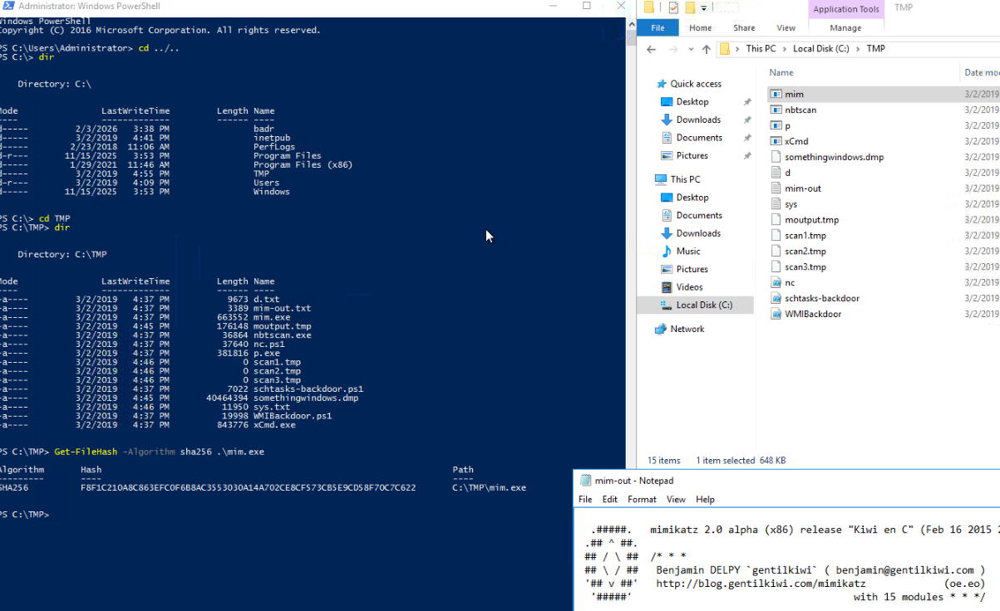 

El sha256 es:   
F8F1C210A8C863EFC0F6B8AC3553030A14A702CE8CF573CB5E9CD58F70C7C622  
Y como se ve, sí que lo es:  

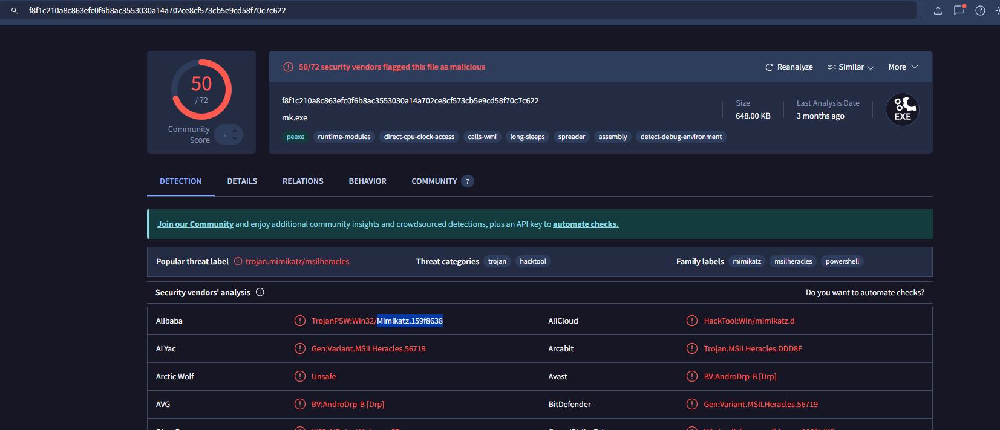

## Cuál fue la ip del atacante para control externo 

Para esto, he buscado en internet “cómo acceder archivo host comunicacion windows”  
[https://sered.net/blog/archivo-host\#:\~:text=en%20guardar%20documento.-,%C2%BFD%C3%B3nde%20encontrar%20el%20archivo%20hosts?,hosts%20en%20caso%20de%20Mac](https://sered.net/blog/archivo-host#:~:text=en%20guardar%20documento.-,%C2%BFD%C3%B3nde%20encontrar%20el%20archivo%20hosts?,hosts%20en%20caso%20de%20Mac).  
Y sale una carpeta: C:\Windows\System32\drivers\etc. Ahí, hay un archivo en el que pone hosts, el cual, al abrirlo ,por ejemplo con el notepad, aparece un listado   

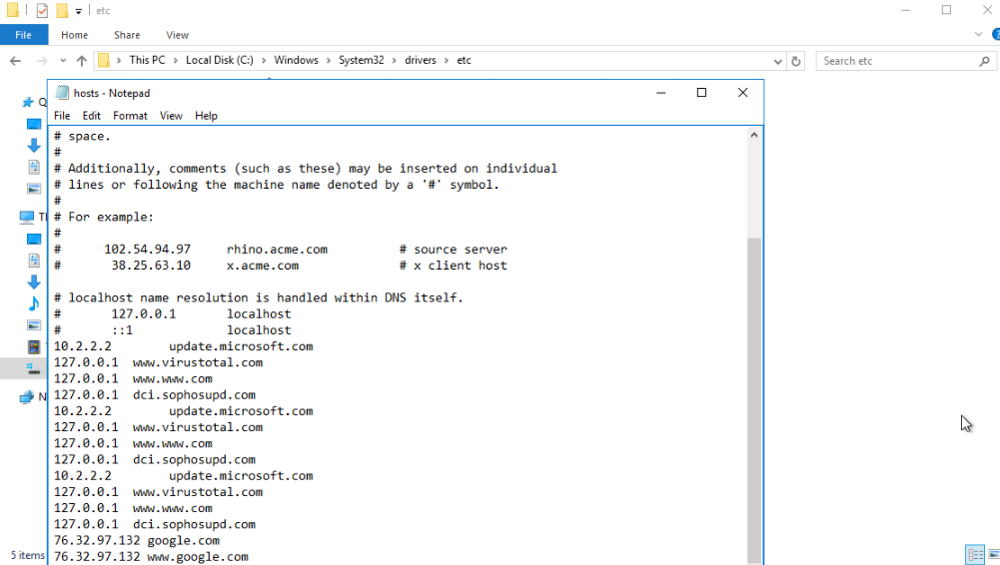

Se descartan las local host(127.0.0.1) y las 10.2.2.2 porque parecen servir para actualizar microsoft y que son “fiables”, por lo que nos deja la ip anomala/mas reciente es 76.32.97.132 que la cual parece ser sospechosamente de google 2 veces. Es una manera de los atacantes de “ocultar” su rastro(dns poisoning), y/o redirigir al usuario, en este caso, parece que lo redirigió a otro lado

## Extensión del archivo del shell subido en la web del servidor **

Tras revisar un rato las carpetas del ordenador, en local disk, me encontré con una cuya fecha de modificación era la misma que con la que inició el ataque, y la hora era ligeramente posterior a la hora de asignación de permisos de administración al nuevo logon. La carpeta era inetpub, dentro de this pc→local disk(C:), dentro de ella habia una carpeta llamada wwwroot ,dentro de la cual había 3 archivos moificados a la misma hora:  

- b.jsp  
- shell.gif  
- tests.jsp  

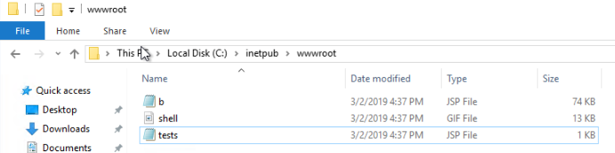 

Los jsp son una “tecnología” java para crear paginas web dinámicas. Es posible usarlo en ataques. El archivo b.jsp parece ser un programa  

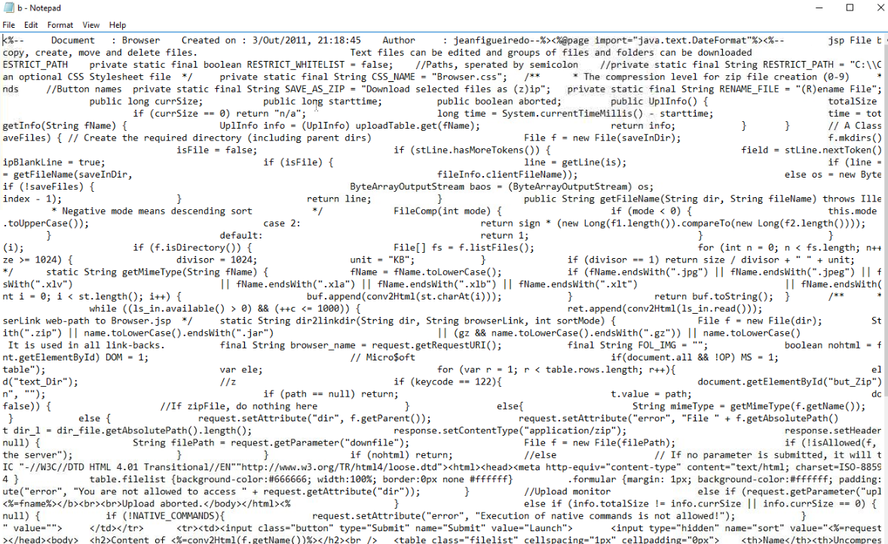  

Al igual que tests:  

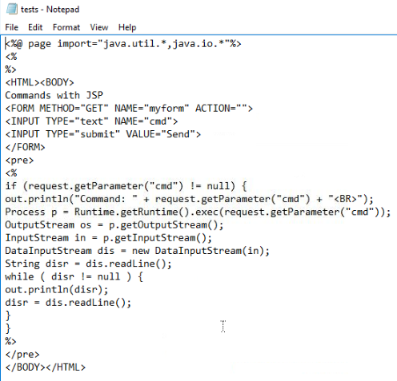 

Que parece buscar ejecutar el shell  

## Último puerto abierto por el atacante  

La pista dice firewall, por lo que voy a buscarlo  

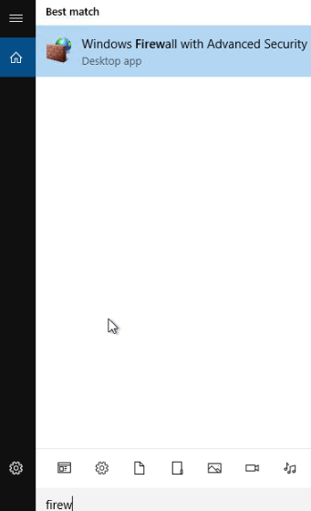  

Tras meterme en él, y explorar las carpetas/alertas dentro de mismo , en la primera , inbound rules, hay una alerta cuyo nombre indica que permite conexiones externas para desarrollo, siendo la única de ese tipo, y es sospechosa por el propio nombre de la acción. Se ve que el puerto local usado es el 1337  

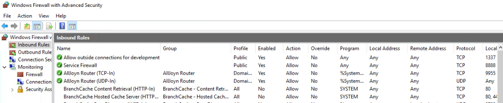

## Página web dns poisoning  

En otra pregunta anterior se ve que la ip atacante /redirigida era a google, con dns poisoning tras buscar lo que es  

