# Summit  
[https://tryhackme.com/room/summit](https://tryhackme.com/room/summit)

[GitHub: Ch4mbi](https://github.com/Ch4mbi)

Tras encender la máquina, y acceder a ella, se trae a esta ventana:  
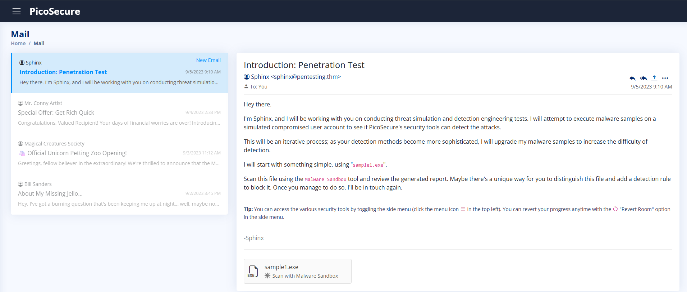
## What is the first flag you receive after successfully detecting sample1.exe?  
### ¿Cual es la primera flag encontrada tras detectar sample1.exe?  
Siendo el primer correo este:  
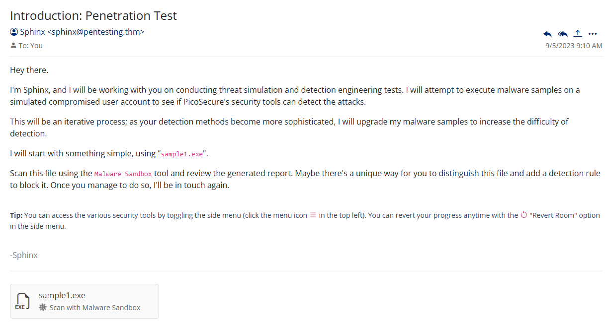
Tras seleccionar el archivo, nos lleva a una “sandbox” en la cual se puede analizar dicho malware:  
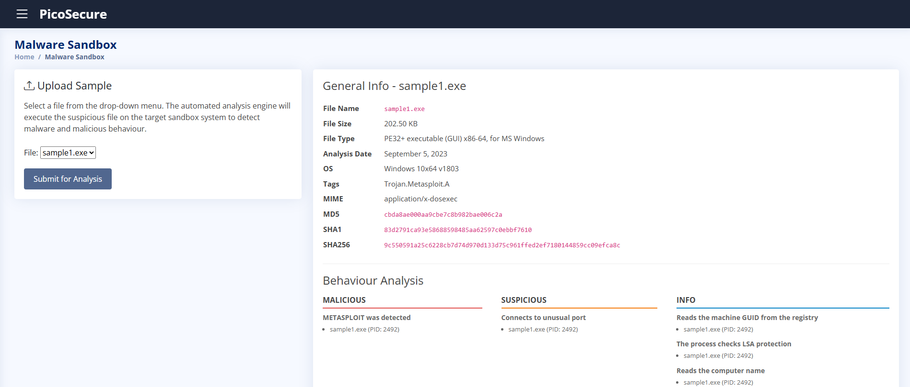
Tras obtener los hashes de ahí, se puede uno ir a la opción de `Manage hashes`, en la cual, si se meten las características del MD5, se puede bloquear como medida preventiva.  
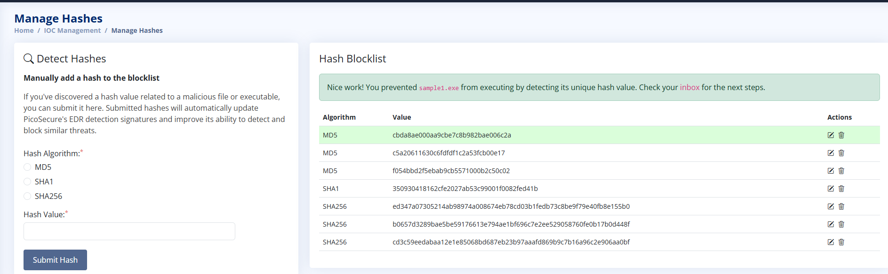
Y a continuación obteniendo la flag:  
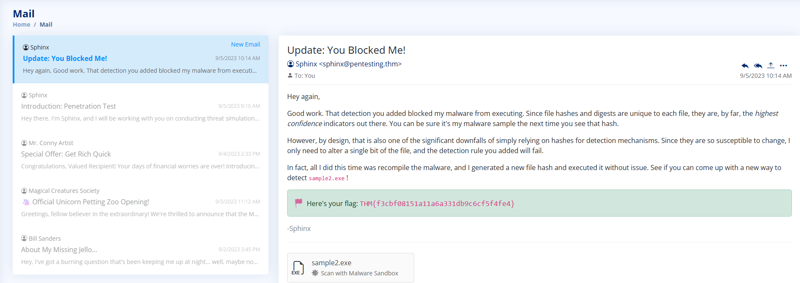
Y dándonos el objetivo de la pregunta 2, sample2.exe

## What is the second flag you receive after successfully detecting sample2.exe?  
### ¿Cual es la segunda flag encontrada tras detectar sample2.exe?  
Primero se va a analizar para poder obtener información del mismo, como hashes y/o características:  
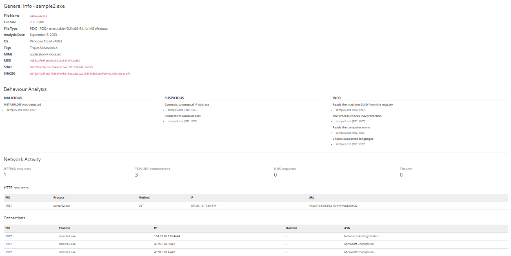 
Entre ellas, se puede ver una nueva, network activity.  
 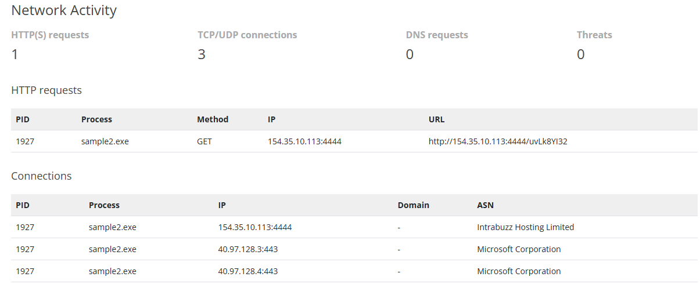
Con esa nueva información, hay varias posibilidades, como bloqueos de urls o de ip, lo cual se puede hacer desde el firewall manager creando una nueva norma en el mismo.  Hay que centrarse en que debe de consistir la regla. Parece que una conexión http se hizo al servidor propio del atacante, probablemente C2.También, en connections TCP/UDP, se ve como se han llevado a cabo varias, llamando la que más la atención la que tiene la misma ip y puerto que el servidor C2 del atacante, ya que el resto son https (puerto 443).  
En la sección de firewall rule manager, se puede establecer una nueva norma, la cual consiste en establecer:  
- Egress: Para bloquear el tráfico saliente a un objetivo  
- La source IP como “any” para que cualquier dispositivo interno a la red no se vea afectado por ese ataque (154.35.10.113) saliente  
- La destination IP debe de ser la del atacante para bloquearlo  
- La acción, evidentemente, debe de ser deny para bloquear dicho tráfico saliente  
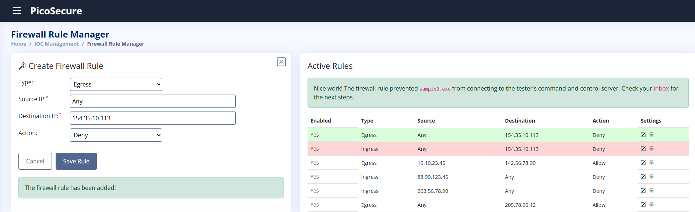  
Después, se recibirá un correo con la flag y el objetivo del sample3.exe  
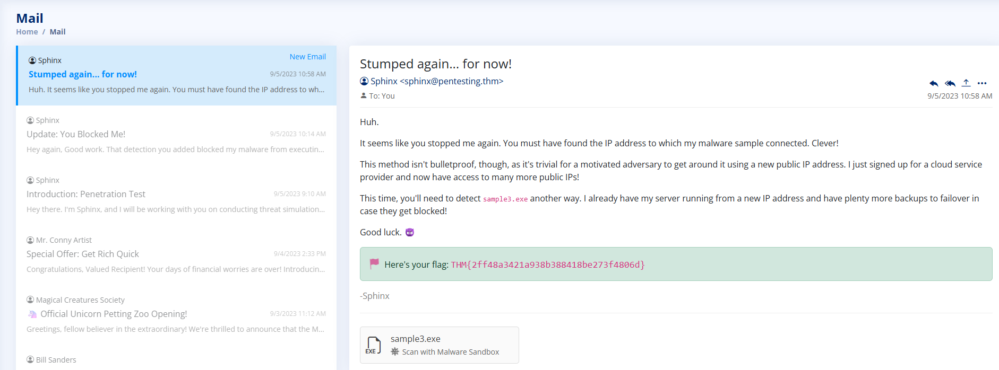  
## What is the third flag you receive after successfully detecting sample3.exe?  
### ¿Cual es la tercera flag encontrada tras detectar sample1.exe?  
Tras analizar el malware, se obtienen más características, otra vez, de network activity:  
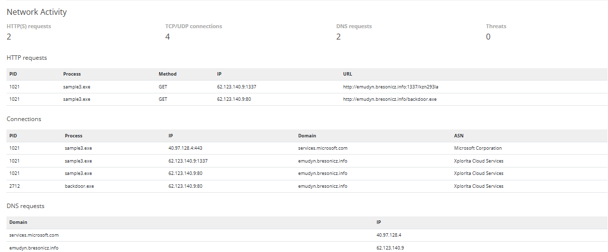  
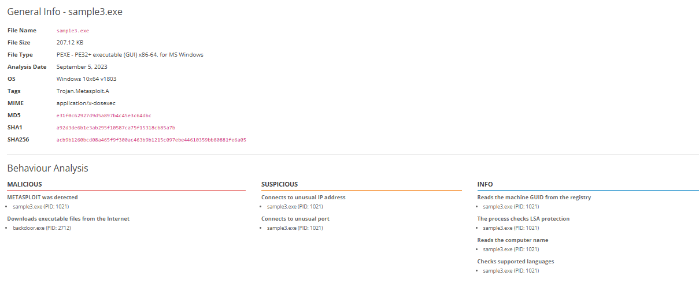
Como característica nueva, hay solicitudes dns, lo que puede indicar el abuso de DNS para redirigir el tráfico al servidor C2 del atacante o llevar a cabo otras acciones. Hay pistas, como que hay un proceso en connections llamado backdoor.exe, el cual está asociado a un dominio llamado emudyn.bresonicz.info, el cual está presente en las DNS requests, con la ip 62.123.140.9  
Se puede crear una nueva DNS rule, accediendo al DNS rule manager. La categoría debe de ser malware al ser un backdoor, el dominio es el de emudyn y la acción debe de ser negar:  
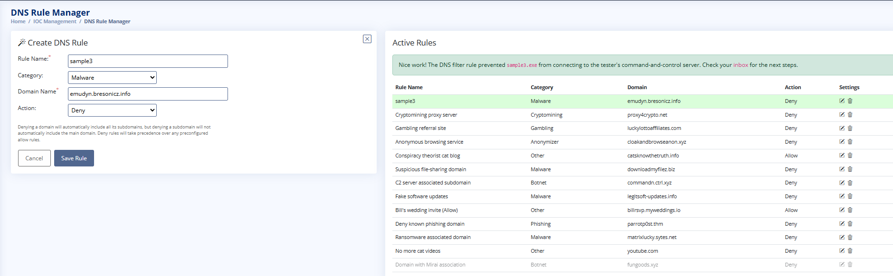  
Esto, otra vez, dará la flag y nos dará el contenido para el sample4.exe  
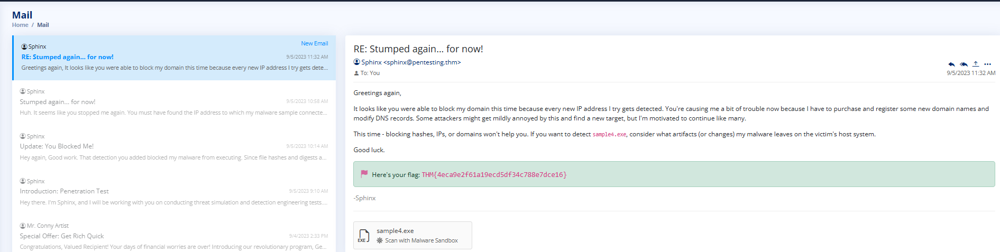

## What is the fourth flag you receive after successfully detecting sample4.exe?  
### ¿Cual es la cuarta flag encontrada tras detectar sample4.exe?  
Tras analizar el sample 4 en el sandbox, se obtiene más información  
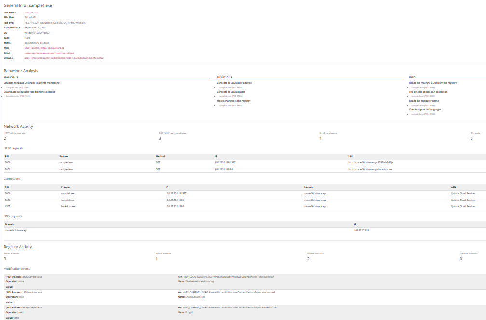 
Aparte de la actividad en la red, hay ahora un registro de actividad en el cual se ven varios eventos, 1 de lectura y 2 de escritura, de los cuales uno tiene el nombre de DisableRealtimeMonitoring lo cual es muy sospechoso, pareciendo que ha quitado la característica de monitoreo de eventos en tiempo real y hay que tener en cuenta que es una posible táctica de evasión de defensa, la cual, se pide el ATT&CK ID, el cual se buscará.  
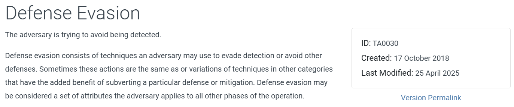 
Aunque hay un problema, y es que en las opciones, no hay TA0030, el único que tiene que ver con defense evasion es TA0005, el cual aparece en las opciones. También, las opciones que se deben seccionales al entender la naturaleza del ataque son qué ha consistido en system event logs, y regstry modifications   
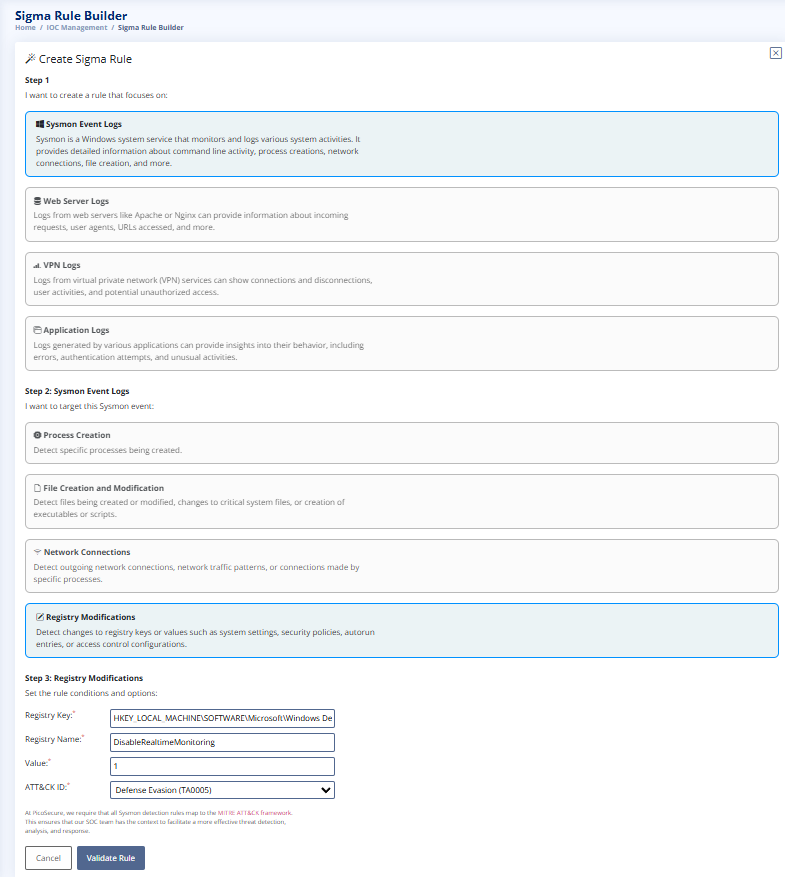
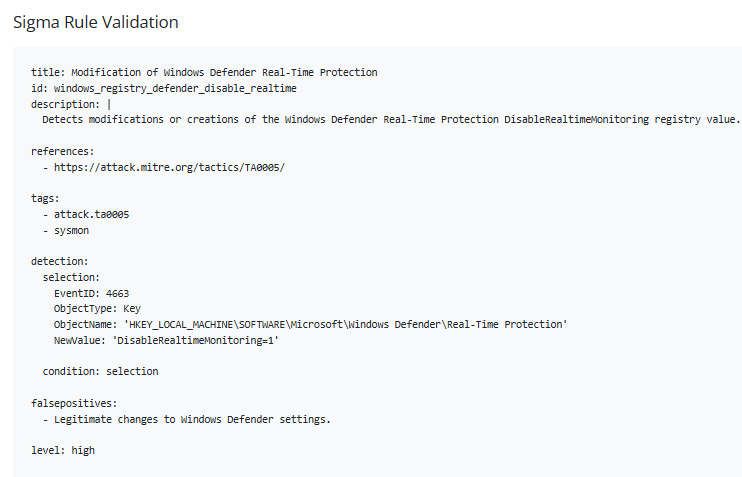  
Tras aplicarla correctamente, se recibirá la flag:  
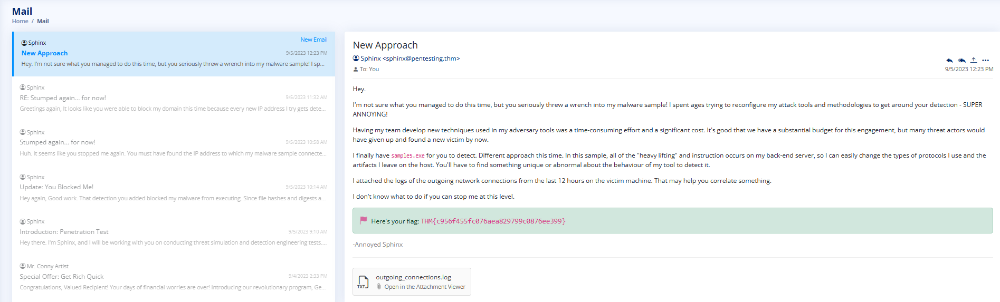

## What is the fifth flag you receive after successfully detecting sample5.exe?  
### ¿Cual es la quinta flag encontrada tras detectar sample5.exe?  
El sample 5 consiste en un archivo .log el cual es así:  
2023-08-15 09:00:00 | Source: 10.10.15.12 | Destination: 51.102.10.19 | Port: 443 | Size: 97 bytes  
2023-08-15 09:23:45 | Source: 10.10.15.12 | Destination: 43.10.65.115 | Port: 443 | Size: 21541 bytes  
2023-08-15 09:30:00 | Source: 10.10.15.12 | Destination: 51.102.10.19 | Port: 443 | Size: 97 bytes  
2023-08-15 10:00:00 | Source: 10.10.15.12 | Destination: 51.102.10.19 | Port: 443 | Size: 97 bytes  
2023-08-15 10:14:21 | Source: 10.10.15.12 | Destination: 87.32.56.124 | Port: 80  | Size: 1204 bytes  
2023-08-15 10:30:00 | Source: 10.10.15.12 | Destination: 51.102.10.19 | Port: 443 | Size: 97 bytes  
2023-08-15 11:00:00 | Source: 10.10.15.12 | Destination: 51.102.10.19 | Port: 443 | Size: 97 bytes  
2023-08-15 11:30:00 | Source: 10.10.15.12 | Destination: 51.102.10.19 | Port: 443 | Size: 97 bytes  
2023-08-15 11:45:09 | Source: 10.10.15.12 | Destination: 145.78.90.33 | Port: 443 | Size: 805 bytes  
2023-08-15 12:00:00 | Source: 10.10.15.12 | Destination: 51.102.10.19 | Port: 443 | Size: 97 bytes  
2023-08-15 12:30:00 | Source: 10.10.15.12 | Destination: 51.102.10.19 | Port: 443 | Size: 97 bytes  
2023-08-15 13:00:00 | Source: 10.10.15.12 | Destination: 51.102.10.19 | Port: 443 | Size: 97 bytes  
2023-08-15 13:30:00 | Source: 10.10.15.12 | Destination: 51.102.10.19 | Port: 443 | Size: 97 bytes  
2023-08-15 13:32:17 | Source: 10.10.15.12 | Destination: 72.15.61.98  | Port: 443 | Size: 26084 bytes  
2023-08-15 14:00:00 | Source: 10.10.15.12 | Destination: 51.102.10.19 | Port: 443 | Size: 97 bytes  
2023-08-15 14:30:00 | Source: 10.10.15.12 | Destination: 51.102.10.19 | Port: 443 | Size: 97 bytes  
2023-08-15 14:55:33 | Source: 10.10.15.12 | Destination: 208.45.72.16 | Port: 443 | Size: 45091 bytes  
2023-08-15 15:00:00 | Source: 10.10.15.12 | Destination: 51.102.10.19 | Port: 443 | Size: 97 bytes  
2023-08-15 15:30:00 | Source: 10.10.15.12 | Destination: 51.102.10.19 | Port: 443 | Size: 97 bytes  
2023-08-15 15:40:10 | Source: 10.10.15.12 | Destination: 101.55.20.79 | Port: 443 | Size: 95021 bytes  
2023-08-15 16:00:00 | Source: 10.10.15.12 | Destination: 51.102.10.19 | Port: 443 | Size: 97 bytes  
2023-08-15 16:18:55 | Source: 10.10.15.12 | Destination: 194.92.18.10 | Port: 80  | Size: 8004 bytes  
2023-08-15 16:30:00 | Source: 10.10.15.12 | Destination: 51.102.10.19 | Port: 443 | Size: 97 bytes  
2023-08-15 17:00:00 | Source: 10.10.15.12 | Destination: 51.102.10.19 | Port: 443 | Size: 97 bytes  
2023-08-15 17:09:30 | Source: 10.10.15.12 | Destination: 77.23.66.214 | Port: 443 | Size: 9584 bytes  
2023-08-15 17:27:42 | Source: 10.10.15.12 | Destination: 156.29.88.77 | Port: 443 | Size: 10293 bytes  
2023-08-15 17:30:00 | Source: 10.10.15.12 | Destination: 51.102.10.19 | Port: 443 | Size: 97 bytes  
2023-08-15 18:00:00 | Source: 10.10.15.12 | Destination: 51.102.10.19 | Port: 443 | Size: 97 bytes  
2023-08-15 18:30:00 | Source: 10.10.15.12 | Destination: 51.102.10.19 | Port: 443 | Size: 97 bytes  
2023-08-15 19:00:00 | Source: 10.10.15.12 | Destination: 51.102.10.19 | Port: 443 | Size: 97 bytes  
2023-08-15 19:30:00 | Source: 10.10.15.12 | Destination: 51.102.10.19 | Port: 443 | Size: 97 bytes  
2023-08-15 20:00:00 | Source: 10.10.15.12 | Destination: 51.102.10.19 | Port: 443 | Size: 97 bytes  
2023-08-15 20:30:00 | Source: 10.10.15.12 | Destination: 51.102.10.19 | Port: 443 | Size: 97 bytes  
2023-08-15 21:00:00 | Source: 10.10.15.12 | Destination: 51.102.10.19 | Port: 443 | Size: 97 bytes

[GitHub: Ch4mbi](https://github.com/Ch4mbi)

Tras analizar los logs, se ve unos eventos extraños, con un tamaño muy superior al resto de 10293, 45091, 95021 y 26084 bytes , pero por el puerto 443(https) y otros dos por el puerto 80 (http) que tienen tamaños de 1204 y 8004 bytes respectivamente:  
 2023-08-15 10:14:21 | Source: 10.10.15.12 | Destination: 87.32.56.124 | Port: 80  | Size: 1204 bytes  
2023-08-15 13:32:17 | Source: 10.10.15.12 | Destination: 72.15.61.98  | Port: 443 | Size: 26084 bytes  
2023-08-15 14:55:33 | Source: 10.10.15.12 | Destination: 208.45.72.16 | Port: 443 | Size: 45091 bytes  
2023-08-15 15:40:10 | Source: 10.10.15.12 | Destination: 101.55.20.79 | Port: 443 | Size: 95021 bytes  
2023-08-15 16:18:55 | Source: 10.10.15.12 | Destination: 194.92.18.10 | Port: 80  | Size: 8004 bytes  
2023-08-15 17:09:30 | Source: 10.10.15.12 | Destination: 77.23.66.214 | Port: 443 | Size: 9584 bytes  
2023-08-15 17:27:42 | Source: 10.10.15.12 | Destination: 156.29.88.77 | Port: 443 | Size: 10293 bytes  
Algo llamativo y relevante es que los paquetes más pequeños son hacia la misma ip, pero los más grandes/llamativos son aquellos que tienen como destino otras ip totalmente diferentes entre sí. Los que tienen la misma ip de destino, sin embargo, se hacen cada 30 minutos casi de manera automatizada a la misma ip, lo que puede indicar que esté obteniendo el atacante información cada 30 minutos sobre el host de su malware, haciéndolo más sospechoso que los paquetes grandes descontinuados.  
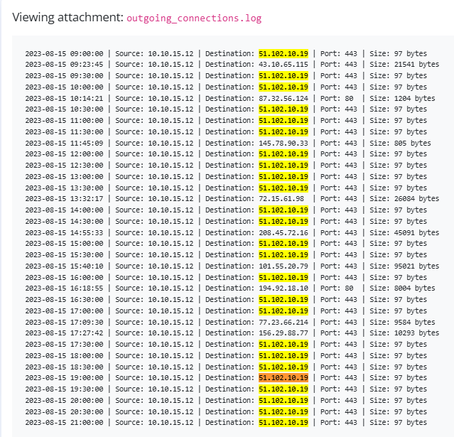  
Se puede crear una nueva sigma rule para este caso. Seleccionando sysmon event logs, network connections y establecer cómo Any cualquier IP(ya que el atacante puede intentar cambiar de ip) o puerto para intentar evitar dicho ataque. Las características son los 1800 segundos (30 minutos entre eventos) y el tamaño fijo de 97 Bytes  
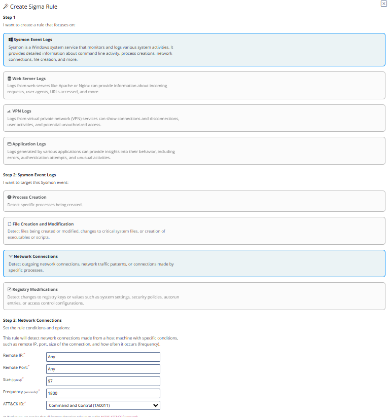
Dando así la flag:  
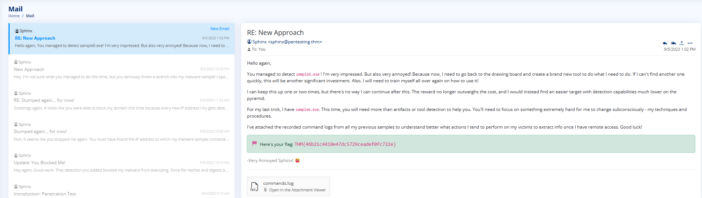 
## What is the final flag you receive from Sphinx?  
### ¿Cual es la flag final encontrada recibida de Sphinx?  
Con el último, se me dá esta información de commands.log  
dir c: >> %temp%exfiltr8.log  
dir "c:Documents and Settings" >> %temp%exfiltr8.log  
dir "c:Program Files" >> %temp%exfiltr8.log  
dir d: >> %temp%exfiltr8.log  
net localgroup administrator >> %temp%exfiltr8.log  
ver >> %temp%exfiltr8.log  
systeminfo >> %temp%exfiltr8.log  
ipconfig /all >> %temp%exfiltr8.log  
netstat -ano >> %temp%exfiltr8.log  
net start >> %temp%exfiltr8.log

Esto, evidentemente, parecen comandos externos los cuales parecen dar información sobre el sistema operativo y conexiones de red a %temp%exfiltr8.log, es decir, que esta descubriendo el sistema, lo que, en el cuestionario consiste en el TA0007.  
Se va a crear una nueva sigma rule, la cual se va a seleccionar sysmon event logs, y file creation & modification. Ahí, se va a escribir la ruta a la carpeta %temp% y el nombre del archivo exfiltr8.log y se va a seleccionar en la opción de ATT&CK la opción de Discovery de TA0007  
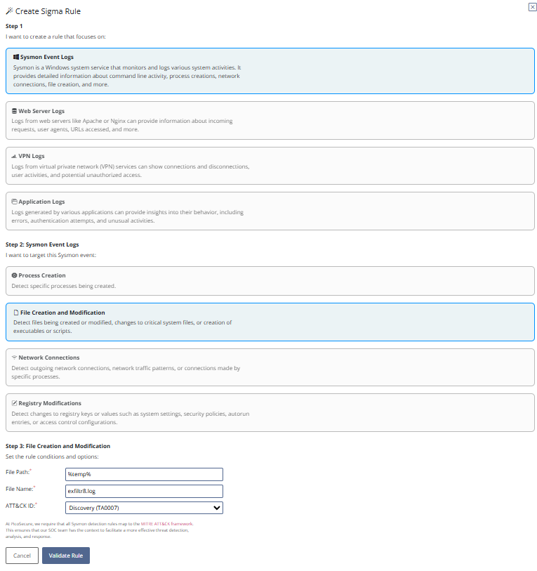  
Recibiendo así la ultima flag:  
 

[GitHub: Ch4mbi](https://github.com/Ch4mbi)
